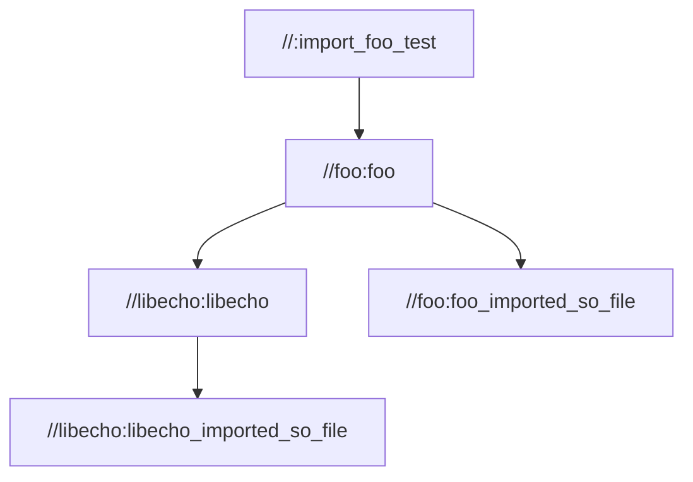

# Demonstration of ld issues with imported shared-lib as python module

## Overview

This uses a shared lib `foo.so` with a dep `libecho.so`:

    (NEEDED)    Shared library: [libecho.so]

And demonstrates the issues with doing so.

## Symptoms

### Missing Dependent Shared Library

Looking at the runfiles tree:

    import_foo_test.runfiles/_main/foo/foo.so
    import_foo_test.runfiles/_main/foo/__init__.py
    import_foo_test.runfiles/_main/import_foo_test
    import_foo_test.runfiles/_main/_solib_k8/__init__.py
    import_foo_test.runfiles/_main/_solib_k8/_U_S_Slibecho_Clibecho___Ulibecho/__init__.py
    import_foo_test.runfiles/_main/_solib_k8/_U_S_Slibecho_Clibecho___Ulibecho/libecho.so
    import_foo_test.runfiles/_main/test.py

We can see that `foo.so` shows up, (and gets loaded), but it fails to load `libecho.so`. Adding
`_solib_k8/_U_S_Slibecho_Clibecho___Ulibecho` to the `LD_LIBRARY_PATH` does solve 
the problem. The issue with that approach is that it's needed by the `foo` library user, but requires
that user to know about the transient deps (`[libecho.so]`) to form the `LD_LIBRARY_PATH`.
