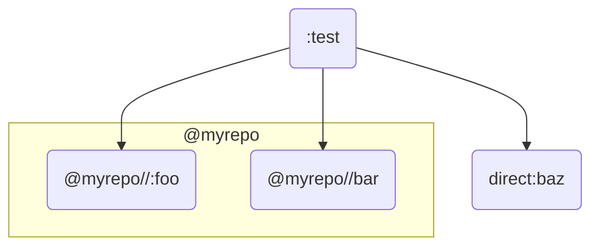

# Test Case: py_library in generated / external repository

## Structure



## Subdirs

- [./BUILD.bazel](./BUILD.bazel) contains the demonstration `py_test` that makes use of the modules.
- [rules/](rules/) contains the "importer" rule used to create the external repository under test. It simply copies the files from the fixed path `rules_py_reporule/imported`.
- [imported/](imported/) contains the contents of the external repository to be imported.
- [direct/](direct/) counterexample showing that a `py_library` from within the `_main` repository is working as expected.

## Repro

The `:test` test case imports two modules from `@myrepo` (one using `imports=["."]` and then other using `imports=[".."]`), and one from `_main`. The one from `_main` is correctly imported while the other two are not.

The second test case `:all_direct` skips the `repository_rule` to demonstrate that the `test.py` itself is correctly implemented and can actually pass when the bug is not exercised.


```console
$ bazel test //rules_py_reporule:test
...
AssertionError: import errors: ["No module named 'foo'", "No module named 'bar'"]
```
